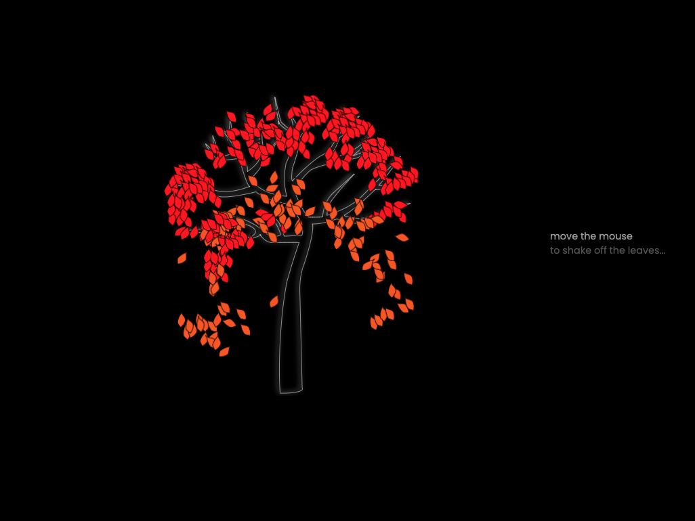

# Tree Animation

A tree animation, built as a potiential welcome page for a portfolio site.

## View

[Demo](woodsfromthetrees.netlify.app)

## Description

Built using an svg, with a separate path for each leaf. 

I manually assigned each leaf a random value and kept the total distance of mouseMoved in state. When the random value is surpassed by the total distance moved, it changes the className of the leaf, triggering the animation.

## Lessons

I wanted to assign the random value for each leaf using Math.random(), but this value is retriggered on each render.